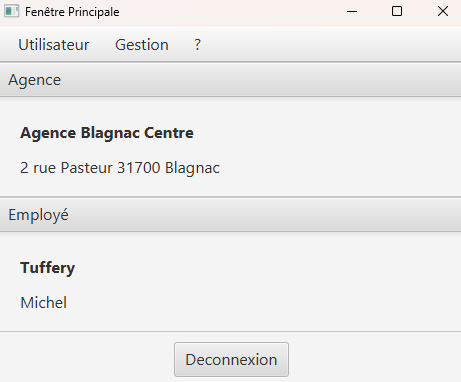
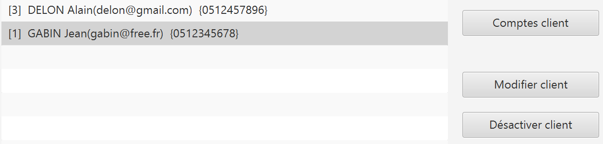
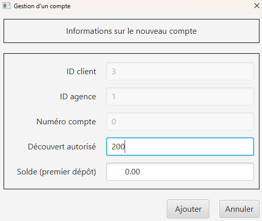
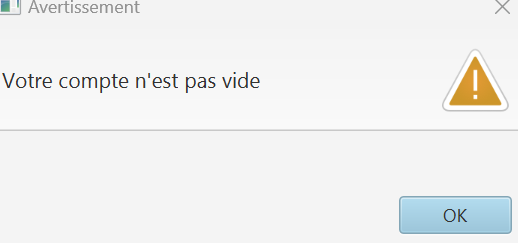
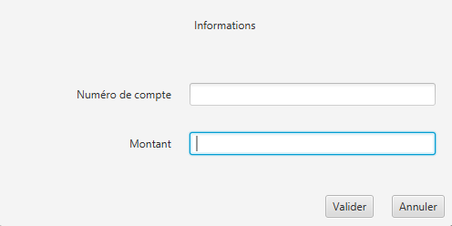

= Documentation utilisateur - DailyBank
=
:toc-title: Sommaire
:toc: macro

*Version :* 0 +
*Date :* 07/05/2024 +
*Créé par :* Équipe 2A3 : _AMERI Mohammed, CIARDI Rudy, RAZAFINIRINA Mialisoa, SHULHINA Daria_ +
*Créé pour :* DailyBank +
*Projet :* SAE DEV/GPO (S2.01/S2.05)

'''

toc::[]

'''

== I. Présentation générale
Bienvenue dans le guide utilisateur de l’application à destination des employés de DailyBank.

Ce guide vous servira à connaître dans les détails les différentes fonctions de l’application.

== II. Rôle de l' application
L'application DailyBank permettra de gérer les comptes bancaires de dépôt des clients. Elle permettra de réaliser les opérations suivantes :

* Consulter le solde d'un compte
* Effectuer des virements entre deux comptes
* Déposer ou retirer de l'argent sur un compte
* Suivre l'historique des transactions

L'application permettra également aux clients de gérer leurs profils et de contacter le service client.

== III. Installation utilisation
L'applicationsera installée sur les ordinateurs des guichetiers et des chefs d'agence de DailyBank. 

Une fois l'application installée, les clients pourront se connecter en utilisant leur login et leur mot de passe.

== IV. Fonctionnement 
L'application DailyBank se compose de plusieurs modules. Dans la version existante, un guichetier peut :

* Modifier informations client (adresse, téléphone, …)
* Créer un nouveau client
* Consulter un compte
* Débiter un compte (BD)

Un chef d’agence peut :

* Rendre inactif un client

Chaque module est responsable d'une fonctionnalité spécifique de l'application. 

Les modules communiquent entre eux pour fournir une expérience utilisateur fluide.

== V. Résultats produits avec jeux d'essai commentés
=== Connexion

Lors de l’ouverture de l’application, vous tomberez sur cette interface :

image::../V0Screens/page de connexion1.png["page de connexion"]

Appuyez sur le bouton ``Connexion`` ou sur ``Utilisateur > Connexion`` pour vous connecter à votre compte.

Renseignez ici votre identifiant et votre mot de passe pour accéder à votre compte :

image::../V0Screens/page de connexion.png["identifiant et mot de passe"]

=== Page d'accueil

Une fois connecté, vous arriverez sur cette fenêtre. Vous verrez les informations de votre agence, ainsi que les informations de l'utilisateur connecté.

=== Déconnexion

Depuis la page d'accueil, appuyez sur ``Deconnexion``, sinon, appuyez sur ``Deconnexion`` depuis le menu ``Utilisateur``.

=== Gérer les clients

Dans le menu, cliquez sur ``Gestion > Clients``.

Une fenêtre va s'ouvrir :

image::../V0Screens/page de gestion des clients.png["page de gestion client"]

Sur cette fenêtre, renseignez le Numéro du client cherché, son nom ou son prénom puis cliquez sur ``Rechercher``,
Si vous souhaiter afficher tout les clients, ne renseignez aucun champ et appuyez directement sur ``Rechercher``.

*Créer un client*

Depuis l'écran de gestion de clients, cliquez sur ``Nouveau client``.

image::../V0Screens/page gestion d'un noveau client.png["page de gestion client"]

Vous pouvez ici créer un nouveau client en saisissant ces données.

Cliquez sur ``Modifier`` pour valider ou sur ``Annuler`` pour revenir en arrière.

*Modifier un client*

Depuis l'écran de gestion de clients, cliquez sur ``Modifier client``.

image::../V0Screens/page gestion d'un client.png["page de modification client"]

Vous pouvez ici changer les données d’un client. +
A noter que seul un chef d’agence peut modifier l’activité du client.

Cliquez sur ``Modifier`` pour valider ou sur ``Annuler`` pour revenir en arrière.

Rendre "inactif" un client

Pour rendre "inactif" un client, assurez vous d'être connecté en tant que chef d’agence.

Sélectionnez un client (assurez vous qu'il soit affiché en gris) puis cliquez  sur ``Désactiver client``.

=== Gérer comptes bancaires

Depuis l'écran de gestion client, cliquez sur ``Comptes clients``.

Vous arrivez sur cet écran

image::../V0Screens/page gestion des comptes.png["page de gestion comptes"]

*Nouveau compte*

Depuis l'écran précédent, cliquez sur ``Nouveau compte``.

Renseignez les informations du compte, puis cliquez sur ``Ajouter`` ou ``Annuler``.

*Clotûrer compte*

Sélectionnez un compte puis cliquez sur ``Supprimer`` pour clôturer le compte.

*A noter que le solde du compte doit être égal à 0*

=== Gérer les opérations

Depuis la page de gestion des comptes, sélectionnez un compte et cliquez sur ``Voir opérations``.

image::../V0Screens/page gestion des opérations.png["gestion des opérations"]

A noter que l'interface de crédit et débit ont la même interface graphique. De ce fait, les procédures pour les deux opérations sont identiques.

*Enregistrer opération*

Vous avez la possibilité de choisir le type d'opération (crédit/débit) et d'indiquer le montant.

image::../V0Screens/page gestion d'une opération.png["page d'enregistrement de débit/crédit"]

Une fois fait, cliquez sur ``Effectuer débit/crédit`` ou ``Annuler débit/crédit``.

*Enregistrer virement*

Dans l’onglet prélèvement, indiquez le numéro de compte destinataire ainsi que le montant de la transaction.

=== Gérer les employés

De la même manière que l’onglet de gestion des clients, vous pouvez gérer les employés en tant que chef d'agence.

image::../V0Screens/page de gestion des employes.png["page de gestion des employés"]
