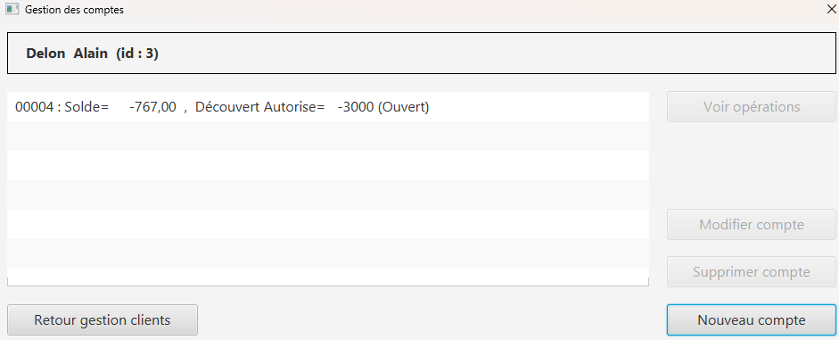

= Cahier Des Charges Utilisateur
=
:toc-title: Sommaire
:toc: macro 

*Par :*;;
Équipe 2A3 : _AMERI Mohammed, CIARDI Rudy, RAZAFINIRINA Mialisoa, SHULHINA Daria_

*Version : 1* +
*Date : 07/05/2024* +
*Équipe : 2A3* +
*Projet : SAE GPO/DEV (S2.01/S2.05)*

'''

toc::[]

'''

Dans le cadre de notre cours de développement d'application (SAE S2.01) et de gestion de projet (SAE S2.05) nous nous lançons dans ce projet. Notre objectif est d'améliorer une application obsolètes actuellement utilisés par la banque DailyBank pour gérer ses comptes clients et employés.

Pour mener à bien ce projet, nous devrons travailler en équipe, en utilisant nos compétences en développement d'application et en gestion de projet. Nous devrons collaborer étroitement pour comprendre les besoins de DailyBank, concevoir et développer l'application, ainsi que rédiger les documents qui lui sont liés.

Ce projet nous offre une occasion unique d'appliquer nos connaissances théoriques à un contexte réel et de développer des compétences précieuses en matière de développement logiciel et de gestion de projet. Nous sommes impatients de relever ce défi ensemble et de livrer une solution de qualité à notre client.

== I. Présentation de l’organisation
DailyBank est une banque de détail en pleine évolution, cherchant à répondre aux besoins changeants de ses clients dans un monde numérique en constante évolution. Avec l'essor des applications financières, DailyBank reconnaît l'importance cruciale d'une présence numérique forte pour rester compétitif sur le marché bancaire européen.

Dans le cadre de sa stratégie de modernisation, DailyBank souhaite remplacer ses outils bancaires obsolètes par une nouvelle application de gestion des comptes clients. Cette initiative vise à offrir une expérience bancaire plus efficace et plus pratique pour ses clients, tout en simplifiant les opérations internes pour le personnel de la banque.

Ce cahier des charges détaille les objectifs et les exigences de DailyBank pour le développement de cette nouvelle application, qui sera déployée dans ses 100 agences à travers le pays. Il s'agit d'une étape importante dans la transformation numérique de DailyBank, visant à maintenir sa position en tant que leader de la banque de détail en Europe.

== II. L’étude de l’existant
Dans l'étude de l'existant, nous constatons que la version V0 de l'application "Daily Bank" offre des fonctionnalités de base pour la gestion des comptes clients au sein des agences de la banque DailyBank. Les guichetiers ont la capacité de modifier les informations des clients, notamment leur adresse et leur numéro de téléphone. De plus, ils peuvent créer de nouveaux clients dans le système et consulter les informations relatives aux comptes existants. Finalement, les guichetiers peuvent aussi effectuer des opérations de débit sur les comptes des clients.

image::../V0Screens/page d'accueil.png[title="page d'accueil"]
image::../V0Screens/page de connexion.png[title="page de connexion"]

image::../V0Screens/page gestion des opérations.png[title="page gestion des opérations"]

'''

Cependant, cette version présente certaines limitations. Elle ne permet pas aux guichetiers de créditer des comptes, de créer de nouveaux comptes, d'effectuer des virements ou de clôturer des comptes, ce qui limite leurs fonctionnalités. De plus, les chefs d'agence ne disposent pas d'outils pour gérer les employés ou pour effectuer d'autres tâches administratives importantes.

En résumé, bien que l'application "Daily Bank" remplisse certaines fonctions de base, elle ne répond pas pleinement aux besoins opérationnels de la banque. Des améliorations sont nécessaires pour permettre une gestion efficace des comptes clients et des opérations bancaires au sein des agences de DailyBank.

== III. L’analyse des besoins
Les besoins pour l'application de gestion des comptes clients de la banque DailyBank peuvent être divisés en deux catégories : les besoins fonctionnels et les besoins non fonctionnels.

.*Besoins fonctionnels :*

* Créer un compte bancaire pour un nouveau client.
* Permettre au guichetier de créditer ou débiter un compte bancaire par virement ou en personne.
* Autoriser les transferts de fonds entre les comptes bancaires de clients.
* Gérer les comptes bancaires inactifs et les clôturer si nécessaire.
* Permettre au chef d'agence de gérer les employés et leurs informations.

.*Besoins non fonctionnels :*

* Sécurité : Assurer la confidentialité des données des clients et la protection contre les accès non autorisés.
* Performance : Fournir un service en temps réel avec une réponse rapide, même en cas de forte charge.
* Ergonomie : Concevoir une interface utilisateur intuitive et conviviale pour faciliter l'utilisation par le personnel de la banque.
* Fiabilité : Assurer la disponibilité continue de l'application pour éviter toute interruption des services bancaires.
* Maintenance : Faciliter la maintenance et la gestion de l'application pour garantir sa stabilité et sa mise à jour régulière.

== IV. Les contraintes

Les contraintes du projet sont les limitations et les conditions auxquelles nous devons nous conformer lors du développement de l'application pour la banque DailyBank. Ces contraintes comprennent Contraintes organisationnelles, Contraintes techniques, Contraintes humaines, Contraintes financières.

Les contraintes organisationnelles font référence aux limites liées à la disponibilité des personnes impliquées dans le projet ainsi qu'à l'accès aux locaux nécessaires pour mener à bien les différentes étapes du développement de l'application.

Les contraintes techniques concernent les limitations imposées par les bases de données déjà existantes, les logiciels utilisés par l'organisation, ainsi que toute autre contrainte liée à l'infrastructure technologique en place. Il est important de prendre en compte ces contraintes pour assurer la compatibilité et l'intégration réussie de la nouvelle application.

Les contraintes humaines se réfèrent aux compétences disponibles au sein de l'équipe chargée du projet. Il est essentiel de s'assurer que les membres de l'équipe possèdent les compétences nécessaires pour développer, tester et déployer l'application de manière efficace.

Enfin, les contraintes financières sont déterminées par le budget alloué au projet. Il est important de respecter ce budget afin de garantir la viabilité financière du projet et d'éviter les dépassements de coûts imprévus.

Ces contraintes seront prises en compte à chaque étape du projet pour assurer le succès de l'application et répondre aux attentes de la banque DailyBank.

== V. La description de la solution

La solution proposée pour le projet de développement de l'application de gestion des comptes clients de DailyBank comprend plusieurs éléments clés.

Tout d'abord, un diagramme des cas d'utilisation sera fourni pour visualiser clairement les différentes actions que les utilisateurs pourront effectuer avec l'application, telles que la création de compte, les opérations de crédit et de débit, etc.

image::Use Case V2 DailyBank.png[title="Diagramme des cas d'utilisation de l'application"]

'''

Les nouvelles fonctionnalités nécessaires pour l'application incluent la capacité de créditer et de débiter les comptes, ainsi que de créer de nouveaux comptes. De plus, il est important d'ajouter la possibilité d'effectuer des virements entre comptes et de clôturer les comptes existants.

Dans le cadre de l'amélioration de l'expérience utilisateur, il est également essentiel de permettre la gestion complète des employés par les chefs d'agence, y compris la création, la modification et la suppression des comptes des guichetiers et des chefs d'agence.

En ce qui concerne les fonctionnalités avancées, l'application devra être capable de générer des relevés mensuels en format PDF et de gérer les prélèvements automatiques pour les clients.

La nouvelle application doit fonctionner rapidement et sans problème, même lorsque de nombreuses personnes l'utilisent en même temps. Elle doit également être sécurisée, ce qui signifie qu'elle doit protéger les informations confidentielles des clients et empêcher les hackers d'y accéder. Pour garantir cela, des mesures spéciales seront prises pour s'assurer que seules les personnes autorisées peuvent accéder à l'application et que les données sont stockées en toute sécurité. En résumé, la nouvelle application doit être rapide, fiable et sécurisée pour répondre aux besoins des utilisateurs et protéger les informations sensibles.

Pour déployer l'application dans les agences de DailyBank, nous l'installerons progressivement dans chaque agence, en fournissant une formation adaptée au personnel sur la façon d'utiliser l'application pour des tâches telles que la création de comptes et les opérations bancaires. Des supports de formation simples seront fournis, et un soutien continu sera assuré pour garantir une utilisation efficace de l'application après le déploiement initial.

== VI. La définition de la procédure de mise en œuvre

Pour réussir ce projet, nous nous organiserons de la manière suivante :

Le chef de projet est *AMERI Mohammed*. Ses missions principales incluent la coordination des équipes, la gestion des ressources, la rédaction du cahier des charges utilisateur, ainsi que la supervision générale du projet.

La colaboratrice responsable du GAUNTT est *RAZAFINIRINA Mialisoa*, elle s'est occupée de réaliser un planning détaillé des tâches à réaliser, avec une répartition claire des responsabilités. Un diagramme de Gantt sera utilisé pour visualiser les étapes clés du projet et les délais associés à chaque tâche.

*CIARDI Rudy*, responsable de la rédaction du cahier des recettes, a supervisé l'ensemble du processus de création de ce dernier pour garantir sa qualité et sa conformité aux exigences du projet.

La personne chargée de la rédaction de la Documentation Utilisateur est *SHULHINA Daria*, elle veille à fournir des instructions claires et concises pour l'utilisation de l'application, afin d'assurer une expérience utilisateur optimale.

En ce qui concerne la partie Developpement de l'application, chaque membre de l'équipe codera au moins une fonctionnalité, Un membre qui code une fonctionnalité rédige doc technique, cahier de tests et doc utilisateur correspondants.

Des réunions régulières seront planifiées pour discuter de l'avancement du projet avec l'équipe. Chaque réunion sera accompagnée d'un ordre du jour défini à l'avance pour maximiser l'efficacité.

La communication au sein du groupe se fera de manière transparente et régulière. Des outils collaboratifs tel que Google Docs, discord, Zoom, seront utilisés pour faciliter le partage d'informations et la collaboration entre les membres de l'équipe.

L'avancement du projet sera régulièrement contrôlé par le chef de projet, qui supervisera également la résolution des éventuels problèmes rencontrés en cours de route.

L'évaluation du travail réalisé se fera à travers des revues régulières de l'avancement du projet, ainsi que par la validation des livrables à chaque étape clé.

== VII. Annexes

Gantt du projet : https://github.com/IUT-Blagnac/sae2-01-devapp-2024-sae-2a3/blob/main/V0/Cahier%20de%20Recette%20V0.adoc[lien] +
Documentation Utilisateur : https://github.com/IUT-Blagnac/sae2-01-devapp-2024-sae-2a3/blob/main/V0/DocumentationUtilisateur.adoc[lien] +
Documentation Technique : https://github.com/IUT-Blagnac/sae2-01-devapp-2024-sae-2a3/blob/main/V0/Document%20Technique%20V0.adoc[lien] +
Cahier des Recette : https://github.com/IUT-Blagnac/sae2-01-devapp-2024-sae-2a3/blob/main/V0/Cahier%20de%20Recette%20V0.adoc[lien]

