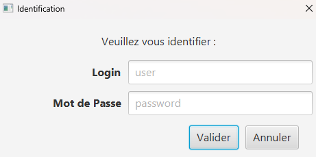
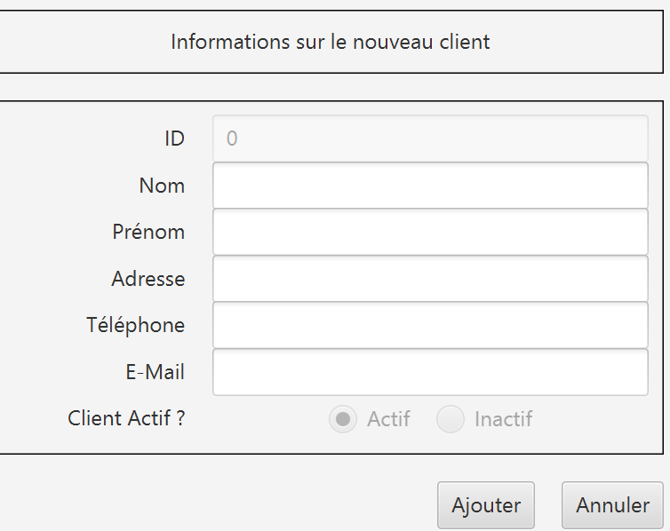

= Documentation utilisateur - DailyBank
=
:toc-title: Sommaire
:toc: macro

*Version :* 1 +
*Date :* 07/05/2024 +
*Créé par :* Équipe 2A3 : _AMERI Mohammed, CIARDI Rudy, RAZAFINIRINA Mialisoa, SHULHINA Daria_ +
*Créé pour :* DailyBank +
*Projet :* SAE DEV/GPO (S2.01/S2.05)

'''

toc::[]

'''

== I. Présentation générale
Bienvenue dans le guide utilisateur de l’application à destination des employés de DailyBank.

Ce guide vous servira à connaître dans les détails les différentes fonctions de l’application.

== II. Rôle de l' application
L'application DailyBank permettra de gérer les comptes bancaires de dépôt des clients. Elle permettra de réaliser les opérations suivantes :

* Consulter le solde d'un compte
* Effectuer des virements entre deux comptes
* Déposer ou retirer de l'argent sur un compte
* Suivre l'historique des transactions

L'application permettra également aux clients de gérer leurs profils et de contacter le service client.

== III. Installation utilisation
L’application sera installée sur les ordinateurs des guichetiers et des chefs d’agence de DailyBank.

=== Pré-requis
Avant l’installation de l’application, assurez-vous que les ordinateurs répondent aux pré-requis suivants :

* Système d'exploitation : Windows 10 ou plus récent.
* Connexion Internet : Connexion stable pour les mises à jour et la synchronisation des données.
* Logiciels requis : Java Runtime Environment (JRE) version 8 ou supérieure, Oracle Database client.

=== Installation
. Téléchargement : Téléchargez le fichier d’installation depuis le serveur interne de DailyBank.
. Exécution : Double-cliquez sur le fichier téléchargé pour lancer l’assistant d’installation.
. Suivi des Instructions : Suivez les instructions à l’écran pour compléter l’installation. Assurez-vous de spécifier les informations spécifiques à l'agence telles que l'identifiant de l'agence et les paramètres réseau.

=== Lancement de l’Application
. Ouverture de l’Application : Une fois installée, lancez l'application via l'icône créée sur le bureau ou dans le menu Démarrer.
. Configuration Initiale : Lors du premier lancement, entrez les informations d’identification de l’agence.
. Formation : Les guichetiers et les chefs d’agence doivent suivre une formation sur l’utilisation de l’application. Cette formation comprendra des sessions pratiques pour se familiariser avec les fonctionnalités de gestion des comptes, traitement des transactions, et consultation des historiques de compte.

=== Connexion des Clients
Une fois l'application installée et configurée, les clients pourront se connecter en utilisant les credentials suivants :

* Login : Le numéro de compte ou l'adresse e-mail enregistrée.
* Mot de Passe : Le mot de passe initial envoyé par e-mail, à modifier lors de la première connexion pour des raisons de sécurité.

=== Fonctionnalités de l’Application
* Connexion Sécurisée : Les clients devront entrer leurs identifiants personnels pour accéder à leur compte. Des mesures de sécurité, telles que l'authentification à deux facteurs, sont en place pour protéger les informations des clients.
* Gestion des Comptes : Les clients pourront consulter leurs soldes, les détails de leurs transactions, et effectuer des opérations bancaires telles que les virements et les paiements.
* Notifications en Temps Réel : Les clients recevront des notifications pour les transactions importantes, les mises à jour de sécurité, et les promotions personnalisées directement sur l'application.
* Support Client Intégré : En cas de problème ou de question, les clients pourront contacter le support technique via un chat intégré à l'application ou par téléphone.

Veuillez vous assurer pour les prochaines versions de respecter la structuration du document ainsi que cette première base qui va dans le bon sens.

== IV. Fonctionnement 
L'application DailyBank se compose de plusieurs modules. Dans la version existante, un guichetier peut :

* Modifier informations client (adresse, téléphone, …)
* Créer un nouveau client
* Consulter un compte
* Débiter un compte (BD)

Un chef d’agence peut :

* Rendre inactif un client

Chaque module est responsable d'une fonctionnalité spécifique de l'application. 

Les modules communiquent entre eux pour fournir une expérience utilisateur fluide.

== V. Résultats produits avec jeux d'essai commentés
=== Connexion

Lors de l’ouverture de l’application, vous tomberez sur cette interface :

image::../V0Screens/page de connexion1.png["page de connexion"]

Appuyez sur le bouton ``Connexion`` ou sur ``Utilisateur > Connexion`` pour vous connecter à votre compte.

Renseignez ici votre identifiant et votre mot de passe pour accéder à votre compte :

=== Page d'accueil

Une fois connecté, vous arriverez sur cette fenêtre. Vous verrez les informations de votre agence, ainsi que les informations de l'utilisateur connecté.

image::../V0Screens/page d'accueil.png["page d'accueil"]

=== Déconnexion

Depuis la page d'accueil, appuyez sur ``Deconnexion``, sinon, appuyez sur ``Deconnexion`` depuis le menu ``Utilisateur``.

=== Gérer les clients

Dans le menu, cliquez sur ``Gestion > Clients``.

Une fenêtre va s'ouvrir :

image::../V0Screens/page de gestion des clients.png["page de gestion client"]

Sur cette fenêtre, renseignez le Numéro du client cherché, son nom ou son prénom puis cliquez sur ``Rechercher``,
Si vous souhaiter afficher tout les clients, ne renseignez aucun champ et appuyez directement sur ``Rechercher``.

*Créer un client*

Depuis l'écran de gestion de clients, cliquez sur ``Nouveau client``.

Vous pouvez ici créer un nouveau client en saisissant ces données.

Cliquez sur ``Modifier`` pour valider ou sur ``Annuler`` pour revenir en arrière.

*Modifier un client*

Depuis l'écran de gestion de clients, cliquez sur ``Modifier client``.

Vous pouvez ici changer les données d’un client. +
A noter que seul un chef d’agence peut modifier l’activité du client.

Cliquez sur ``Modifier`` pour valider ou sur ``Annuler`` pour revenir en arrière.

Rendre "inactif" un client

Pour rendre "inactif" un client, assurez vous d'être connecté en tant que chef d’agence.

image::../V0Screens/page de suppresion client.png["page de suppresion client"]

Sélectionnez un client (assurez vous qu'il soit affiché en gris) puis cliquez  sur ``Désactiver client``.

=== Gérer comptes bancaires

Depuis l'écran de gestion client, cliquez sur ``Comptes clients``.

Vous arrivez sur cet écran

image::../V0Screens/page gestion des comptes.png["page de gestion comptes"]

*Nouveau compte*

Depuis l'écran précédent, cliquez sur ``Nouveau compte``.

image::../V0Screens/page gestion d'un compte.png["page de création de compte"]

Renseignez les informations du compte, puis cliquez sur ``Ajouter`` ou ``Annuler``.

*Clotûrer compte*

Sélectionnez un compte puis cliquez sur ``Supprimer`` pour clôturer le compte.

image::../V0Screens/page d'erreur de suppression de compte.png["erreur suppression compte"]

*A noter que le solde du compte doit être égal à 0*

=== Gérer les opérations

Depuis la page de gestion des comptes, sélectionnez un compte et cliquez sur ``Voir opérations``.

image::../V0Screens/page gestion des opérations.png["gestion des opérations"]

A noter que l'interface de crédit et débit ont la même interface graphique. De ce fait, les procédures pour les deux opérations sont identiques.

*Enregistrer opération*

Vous avez la possibilité de choisir le type d'opération (crédit/débit) et d'indiquer le montant.

image::../V0Screens/page gestion d'une opération.png["page d'enregistrement de débit/crédit"]

Une fois fait, cliquez sur ``Effectuer débit/crédit`` ou ``Annuler débit/crédit``.

*Enregistrer virement*

Dans l’onglet prélèvement, indiquez le numéro de compte destinataire ainsi que le montant de la transaction.

image::../V0Screens/page de virement.png["page de virement"]

=== Gérer les employés

De la même manière que l’onglet de gestion des clients, vous pouvez gérer les employés en tant que chef d'agence.

image::../V0Screens/page de gestion des employes.png["page de gestion des employés"]

