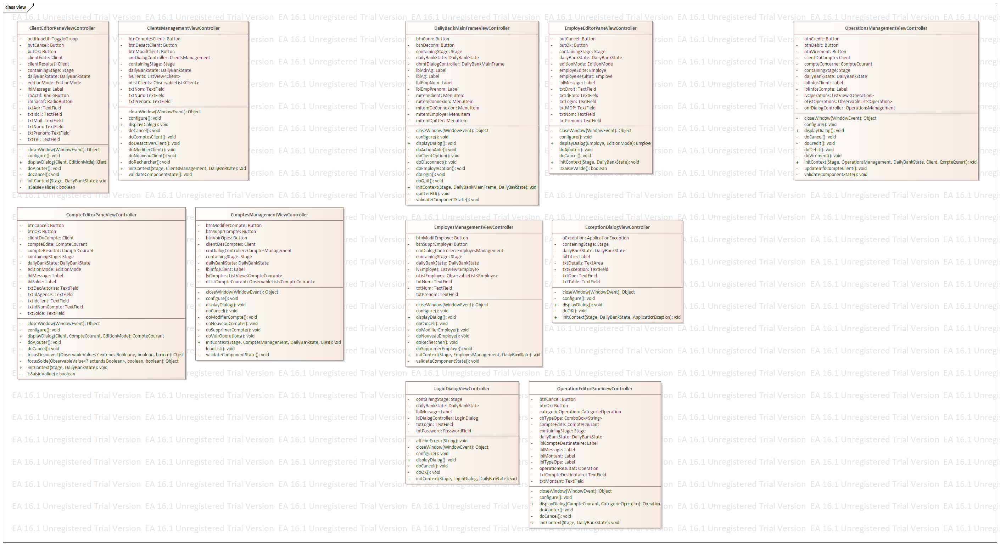

= Document Technique - DailyBankApp
:toc-title: Sommaire
:toc: macro

*Version :* 1 +
*Date :* 07/05/2024 +
*Créé par :* Équipe 2A3 : _AMERI Mohammed, CIARDI Rudy, RAZAFINIRINA Mialisoa, SHULHINA Daria_ +
*Créé pour :* DailyBank +
*Projet :* SAE DEV/GPO (S2.01/S2.05)

'''

toc::[]

'''

== I Présentation de l'application 
Dans le cadre de ce SAE 2.01, notre objectif est de développer une application qui permettra au banque de détail à s'orienter vers une expérience utilisateur "digitale". Cette application vise à améliorer et à moderniser plusieurs outils obsolètes et les processus bancaires existants afin d'effectuer correctement tout type d'action en restant sur une stratégie de réseaux physique et en s'assurant de l'efficacité et surtout de la sécurité. 

=== Fonctionnalités principales : 
Pour permettre le bon fonctionnement de l'application, elle devra permettre au guichetier au chef d'agence de réaliser des actions tel que : 

* Créer un nouveau compte
* Effectuer des débits 
* Effectuer des accréditations par virement de compte à compte ou par une personne physique
* Consulter et mettre à jour les informations sur les comptes (adresse, téléphone,...)
* Clôturer un compte

En plus de ces actions, l'application Daily Bank devra fournir au chef d'agence la possibilité de gérer des comptes, effectuer un débit exceptionnel et simuler un emprunt et une assurance d'emprunt.

=== Fonctionnalités supplémentaires : 
Sachant que l'application est une application dédiée au banque de détail, elle devra générer un relevé mensuel d'un compte en PDF et gérer des prélèvements automatiques.  

== II Architecture 

*Les packages : dans src/main/java :*

* appliction
** DailyBank :main() de départ

* appliction.control
** Contrôleurs de dialogue et accès aux données : gestion des fonctions de l’application. Deux rôles majeurs :
*** Réalise les actions concrètes : accès BD, faire un calcul complexe, générer un fichier, …
*** Ouvre les autres fenêtres nécessaires : gestion du dialogue.

* appliction.view
** Contrôleurs associés aux vues fxml.
*** Gestion de la vue affichée : contrôle des saisies réalisées, messages d’erreurs pour les contrôles de surface, appel du contrôleur de 
    dialogue pour réaliser les actions concrètes.

* Application.tools
** Utilitaires pour application.view et application.control

* model.data
** Classes java mappant les table de la BD. Une table →  1 classe. On peut ajouter  		(classes pour jointures, …)

* model.orm
** Classes d’accès physiques à la BD. Une table → 1 classe offrant différentes méthodes 		pour accéder à la table : select, insert, 
   delete, update, appel de procédure stockée 		(elles sont données). On peut en ajouter.

* Model.exception
** Classes des exceptions spécifiques d’accè à la BD, levées parles classes de model.orm

*Les views fxml : dans src/main/ressources.*

* Application.view
** Vues de l’application : fichier fxml
** Fichier css
		

== III Présentation Et Explication Des Diagrammes
=== 1. Use Case

image::/V0/UseCaseV2DailyBank.png[title="Use Case DailyBank"]

** Le chef d'agence peut toujours faire les mêmes choses q'un guichetier.

*Version V0 :* 

* Création d'un guichetier qui peut :
** créer un nouveau client, 
** consutlter un compte d'un client, 
** modifier les infos d'un client,
** débiter un compte.

* Création d'un chef d'agence qui peut :
** faire pareil q'un guichetier,
** rendre un client inactif.

*Version V1 :* 

* Ajout de fonctionnalités au guichetier tel que 
** créer un nouveau compte client

image::/V0Screens/Use case creaCompteclient.jpg[title="Fait par Mialisoa"]

** créditer un compte 

image::/V0Screens/Use case créditCompte.jpg[title="Fait par Rudy"]
** réaliser un virement d'un compte à un autre

image::/V0Screens/Use case virementCpt-Cpt.jpg[title="Fait par Mohammed"]
** clôturer un compte

image::/V0Screens/Use case clôtureCompte.jpg[title="Fait par Daria"]
* Ajout de fontionnalités au chef d'agence tel que :
** créer un nouveau employé

image::/V0Screens/Use case créaEmployé.jpg[title="Fait par Daria"]
** consulter un employer

image::/V0Screens/Use case consulteEmployé.jpg[title="Fait par Rudy"]
** mettre à jour un employé

image::/V0Screens/Use case metjourEmployé.jpg[title="Fait par Mialisoa"]
** supprimer un employé

image::/V0Screens/Use case suprEmployé.jpg[title="Fait par Mohammed"]

*Version V2 :*

* Autre ajout de fonctionnalités au guichetier tel que : 
** récupérer le relevé pdf d'un compte, 
** créer un nouveau prélevement, 
** consulter un prélevement, 
** modifier un prélevement, 
** supprimer un prélevement.

* Autre ajout de fonctionnalité pour le chef d'agence tel que :
** débiter exceptionnellement un compte
** simuler un emprunt
** simuler une assurance

=== 2. Diagramme de classes 

* DC Application : 

Dans ce diagramme de classes, nous pouvons voir deux classes principales : la classe DailyBankApp et la classe DailyBankState avec ses attributs et ses méthodes.

* DC des classes contrôleurs de dialogue et d'accés aux données : 

Dans ce diagramme, nous pouvons voir tous les classes liées à la gestion du dialogue et l'accés au données. Ces classes sont responsable de la communication entre l'utilisateur et de l'interaction avec la BD.

* DC des classes outils 

Ce diagramme nous montre les classes et énumérations qui fournissent des fonctionnalités auxiliaires à l'application. 

* DC des classes controleurs associées aux vues fxml

Sur ce diagramme, nous pouvons apercevoir tous les classes qui contribuent au contrôle des vues FXML. 

* DC data : 

Ce diagramme présente tous les classes liées aux tables de la base de donnée (AgenceBancaire, Client, CompteCourant, Employe, Operation et TypeOperation). 

* DC des classes d'accés physique à la BD 

Dans ce diagramme, nous avons les classes qui permet d'accéder à la base de données. Chque classe contient plusieurs méthodes pour interagir avec les tables de la base de données. Cela inclut mes méthodes tel que la création, la consultation, les mise à jour et suppression des données. 

* DC des exceptions 

Ce diagramme nous montre les différents classes d'exception utilisées dans l'application. 

== IV Élément De Codes Significatifs Commentés 
