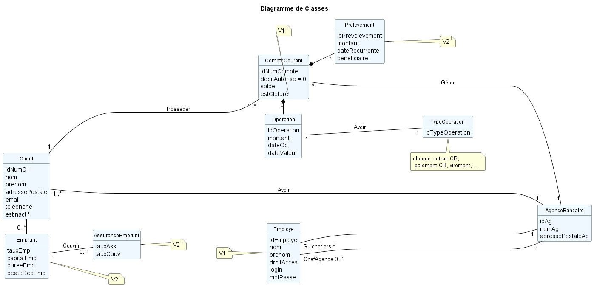

= Document Technique - DailyBankApp
:toc-title: Sommaire
:toc: macro

*Version :* 2 +
*Date :* 14/06/2024 +
*Créé par :* Équipe 2A3 : _AMERI Mohammed, CIARDI Rudy, RAZAFINIRINA Mialisoa, SHULHINA Daria_ +
*Créé pour :* DailyBank +
*Projet :* SAE DEV/GPO (S2.01/S2.05)

'''

toc::[]

'''

== I Présentation de l'application 
Dans le cadre de ce SAE 2.01, notre objectif est de développer une application qui permettra aux banques de détail à s'orienter vers une expérience utilisateur "digitale". Cette application vise à améliorer et à moderniser plusieurs outils obsolètes et les processus bancaires existant afin d'effectuer correctement tout type d'actions en restant sur une stratégie de réseaux physiques et en s'assurant de l'efficacité et surtout de la sécurité. 

=== Fonctionnalités : 
Pour assurer le bon fonctionnement de l'application, elle doit permettre différentes actions en fonction du rôle de l'utilisateur.

Le **chef d’agence**, dans la version V1, pourra créer un employé, consulter et mettre à jour les informations d’un employé, ainsi que supprimer un employé. De plus, il pourra créer un nouveau compte, consulter et mettre à jour les informations des comptes, et clôturer un compte. Dans la version V2, les fonctionnalités s'étendront pour inclure la possibilité d'effectuer un débit exceptionnel sur un compte, de simuler un emprunt et de simuler une assurance.

Le **guichetier**, dans la version V1, pourra créer un compte, créditer et débiter un compte, effectuer un virement, et clôturer un compte, ceux qui sont des actions également réalisables par le chef d’agence. Dans la version V2, le guichetier pourra effectuer un prélèvement en format PDF, créer, consulter, mettre à jour et supprimer un prélèvement.

== II Architecture 

*Les packages : dans src/main/java :*

* Application
** DailyBank :main() de départ

* application.control
** Contrôleurs de dialogue et accès aux données : gestion des fonctions de l’application. Deux rôles majeurs :
*** Réalise les actions concrètes : accès BD, faire un calcul complexe, générer un fichier, …
*** Ouvre les autres fenêtres nécessaires : gestion du dialogue.

* application.view
** Contrôleurs associés aux vues fxml.
*** Gestion de la vue affichée : contrôle des saisies réalisées, messages d’erreurs pour les contrôles de surface, appel du contrôleur de 
    dialogue pour réaliser les actions concrètes.

* application.tools
** Utilitaires pour application.view et application.control

* model.data
** Classes java mappant les table de la BD. Une table →  1 classe. On peut ajouter  		(classes pour jointures, …)

* model.orm
** Classes d’accès physiques à la BD. Une table → 1 classe offrant différentes méthodes 		pour accéder à la table : select, insert, 
   delete, update, appel de procédure stockée 		(elles sont données). On peut en ajouter.

* model.exception
** Classes des exceptions spécifiques d’accè à la BD, levées parles classes de model.orm

*Les views fxml : dans src/main/ressources.*

* Application.view
** Vues de l’application : fichier fxml
** Fichier css
		

== III Présentation Et Explication Des Diagrammes
=== 1. Use Case

image::/V0/UseCaseV2DailyBank.png[title="Use Case DailyBank"]

** Le chef d'agence peut toujours faire les mêmes choses q'un guichetier.

*Version V0 :* 

* Création d'un guichetier qui peut :
** créer un nouveau client, 
** consutlter un compte d'un client, 
** modifier les infos d'un client,
** débiter un compte.

* Création d'un chef d'agence qui peut :
** faire pareil q'un guichetier,
** rendre un client inactif.

*Version V1 :* 

* Ajout de fonctionnalités au guichetier tel que 
** créer un nouveau compte client

image::/V0Screens/Use case creaCompteclient.jpg[title="Fait par Mialisoa"]

** créditer un compte 

image::/V0Screens/Use case créditCompte.jpg[title="Fait par Rudy"]
** réaliser un virement d'un compte à un autre

image::/V0Screens/Use case virementCpt-Cpt.jpg[title="Fait par Mohammed"]
** clôturer un compte

image::/V0Screens/Use case clôtureCompte.jpg[title="Fait par Daria"]
* Ajout de fontionnalités au chef d'agence tel que :
** créer un nouveau employé

image::/V0Screens/Use case créaEmployé.jpg[title="Fait par Daria"]
** consulter un employer

image::/V0Screens/Use case consulteEmployé.jpg[title="Fait par Rudy"]
** mettre à jour un employé

image::/V0Screens/Use case metjourEmployé.jpg[title="Fait par Mialisoa"]
** supprimer un employé

image::/V0Screens/Use case suprEmployé.jpg[title="Fait par Mohammed"]

*Version V2 :*

* Autre ajout de fonctionnalités au guichetier tel que : 
** récupérer le relevé pdf d'un compte, 

image::/V0Screens/Use case PDF.jpg[title="Fait par Mohammed, Rudy"]
** créer un nouveau prélevement,

image::/V0Screens/Use case nouvPrélève.jpg[title="Fait par Rudy"]
** consulter un prélevement, 

image::/V0Screens/Use case consultPrélève.jpg[title="Fait par Mohammed"]
** modifier un prélevement, 

image::/V0Screens/Use case modifPrélève.jpg[title="Fait par Mialisoa"]
** supprimer un prélevement.

image::/V0Screens/Use case supprPrélève.jpg[title="Fait par Daria"]

* Autre ajout de fonctionnalité pour le chef d'agence tel que :
** débiter exceptionnellement un compte

image::/V0Screens/Use case débitExcep.jpg[title="Fait par Mialisoa"]
** simuler un emprunt

image::/V0Screens/Use case simulEmprunt.jpg[title="Fait par Mohammed"]
** simuler une assurance

image::/V0Screens/Use case simulAssure.jpg[title="Fait par Daria"]

=== 2. Diagramme de classes 

==== a. Les classes 

**__AgenceBancaire__**  

Une classe qui représente une agence physique de la banque où les opérations bancaires se déroulent et où les employes et les clients interagissent, d'où une liaison avec la classe Employe. 

*** Attributs :

**** idAg : identifiant unique pour chaque agence 
**** nomAg : nom de l'agence
**** adressePostalAg : adresse de l'agence

**__Employe__**

Cette classe représente les employés travaillant dans l'agence bancaire. Dans une agence bancaire, un employé peut-être chef d'agence ou guichetiers, et ce sont eux qui gèrent les opérations de la banque et servent les clients. 

*** Attributs :

**** idEmploye : identifiant unique pour chaque employé
**** nom : nom de l'employé
**** droitAcces : Droit d'accès des employés. Les chefs d'agences et les guichetiers n'ont pas les mêmes droits 
**** login et mot de passe : nécessaire pour se connecter

**__Client__**

La classe Client représente les clients de la banque et possède un ou des comptes dans la banque. 

*** Attributs :

**** idNumCli : identifiant unique pour chaque client
**** nom : nom du client 
**** prenom : prénom du client 
**** adressePostale : adresse du client 
**** email et telephone : contacte du client
**** estInactif : permet de savoir si le client est actif ou inactif. 

**__CompteCourant__**  

Cette classe représente les comptes courants détenus par les clients. A travers leur compte, les clients peuvent gérer leur argent, effectuer des dépôts, retraits, virements et emprunts. 

*** Attributs :

**** idNumCompte : identifiant unique pour chaque compte
**** debitAutorise : debit autorisé pour chaque compte, elle doit être > 0
**** solde : solde du compte
**** estCloture : indique si le compte est clôturé.

**__Operation__** 

La classe Operation représente la transaction (débit, retraits, virement,...) effectuées sur les comptes courants.

*** Attributs :

**** idOperation : identifiant unique pour chaque opération 
**** montant : montant de l'opération (débit, retrait,...)
**** dateOp : date à laquelle l'opération a été effectuée.
**** dateValeur : date de valeut de l'opération

**__TypeOperation__** 

TypeOperation représente les différents types d'opérations possibles (débit, credit, virement)

*** Attribut :

**** idTypeOperation : identifiant unique chaque type d'opération

**__Emprunt__** 

Représente les emprunts contractés par les clients.

*** Attibuts :

**** tauxEmp : taux de l'emprunt
**** capitalEmp : capital emprunté
**** dureeEmp : durée de l'emprunt
**** dateDebEmp : date de début de l'emprunt

**__EmpruntAssurance__**

Représente les assurances associées aux emprunts afin de protéger la banque et les clients en cas de défaillance de paiement.

*** Attibuts : 

**** tauxAss : taux de l'assurance 
**** tauxCouv : taux de couverture

**__Prelevement__**

Représente les prélèvements effectués sur les comptes courants.

*** Attributs : 

**** idPrelevement : identifiant unique pour chaque prélèvelement 
**** montant : montant du prélèvement 
**** dateRecurrente : date récurrente de prélèvement 
**** beneficiaire : bénéficiaire du prélèvement

==== b. Les liaisons 

** ChefAgence (0..1) -- 1 AgenceBancaire : une agence est gérée par un chef d'agence. 
** Guichetier (*) -- 1 : une agence peut avoir plusieurs guichetiers. 
** Client (1..*) -- 1 AgenceBancaire (Avoir) : un client peut être associé à une ou plusieurs agences bancaires. 
** Client (1) -- (1..*) CompteCourant (Posséder) : un client peut posséder plusieurs comptes dans la banque. 
** CompteCourant (*) -- 1 AgenceBancaire (Gérer) : une agence bancaire gère plusieurs comptes.
** CompteCourant <>-- Operation : un compte peut avoir plusieurs opérations effectuées, et chaque opération est associée à un compte courant. Cependant, cette liaison (par composition) montre que si un compte courant est supprimé, toutes ses opérations associées le seront également.
** Operation (*) -- 1 TypeOperation (Avoir) : chaque opération correspond à un type d'opération.
** Client (1) -- (0..*) Emprunt : un client peut faire plusieurs ou aucun emprunt auprès de la banque.
** Emprunt (1) -- (0..1) AssuranceEmprunt (couvrir) : un emprunt peut être couvert ou non par une assurance. 
** CompteCourant <>-- Prevelement : les prélèvements sont effectués sur les comptes des clients. Cependant, cette liaison (par composition) montre que la suppression du compte courant entraîne la suppression de tous les prélèvements associés.
